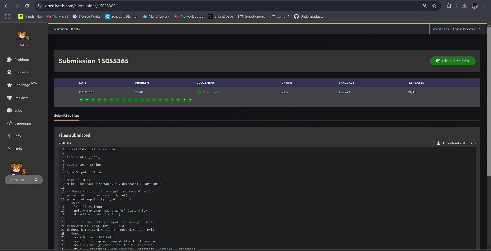

# Journal Entry for "2048"

---

## Problem Description

The problem simulates one move in the 2048 puzzle game. The player is given a grid (4x4) with integers representing tiles, and a move direction (0 for left, 1 for up, 2 for right, 3 for down). The task is to compute the new state of the grid after applying the move and merging tiles according to the rules of 2048.

### Rules

- **Sliding**: All tiles slide as far as possible in the chosen direction until stopped by the edge or another tile.
- **Merging**: Two tiles with the same value merge into one tile with their sum. A tile can merge only once per move.
- **Empty Tiles**: Represented by `0`, and they are ignored during merging and sliding.

---

## Approach and Solution

### Step-by-Step Approach

1. **Input Parsing**:
   - Read the grid (4x4 integers) and the move direction (0-3).
   - The grid is parsed into a list of lists (`Grid`), and the move direction is stored as an integer.

    ```haskell
      parseInput :: Input -> (Grid, Int)
      parseInput input = (grid, direction)
      where
         ls = lines input
         grid = map (map read . words) (take 4 ls)
         direction = read (ls !! 4)
    ```

2. **Handling Moves**:
   - Depending on the move direction:
     - Left (`0`): Shift each row left.
     - Up (`1`): Transpose the grid, shift each row left, then transpose back.
     - Right (`2`): Reverse each row, shift left, and reverse back.
     - Down (`3`): Transpose, reverse each row, shift left, reverse back, and transpose again.

    ```haskell
    move 0 = map shiftLeft
    move 1 = transpose . map shiftLeft . transpose
    move 2 = map (reverse . shiftLeft . reverse)
    move 3 = transpose . map (reverse . shiftLeft . reverse) . transpose
    ```

3. **Merging and Sliding**:
   - A helper function `shiftLeft` processes one row at a time:
     - Filter out `0`s.
     - Merge adjacent tiles if they are equal.
     - Pad the result with `0`s to maintain row length.

    ```haskell
      shiftLeft :: [Int] -> [Int]
      shiftLeft row = merged ++ replicate (length row - length merged) 0
      where
         merged = merge (filter (/= 0) row)
         merge [] = []
         merge [x] = [x]
         merge (x : y : xs)
            | x == y = (x + y) : merge xs
            | otherwise = x : merge (y : xs)
    ```

4. **Output Formatting**:
   - Convert the resulting grid back into the specified format (four lines of space-separated integers).

    ```haskell
    showResult :: Grid -> Output
    showResult = unlines . map (unwords . map show)
    ```

---

## Challenges and Solutions

1. **Tile Merging**:
   - Ensuring that tiles merge correctly without repeated merging in one move required careful handling of pairs.

2. **Transpose Logic**:
   - Moves like "up" and "down" required transposing the grid to reuse the same logic as "left" and "right".

3. **Edge Cases**:
   - Fully empty rows or grids.
   - Multiple merges in a single move.

---

## Testing

### Sample Input 1

```Markdown
2 0 0 2
4 16 8 2
2 64 32 4
1024 1024 64 0
0
```

### Sample Output 1

```Markdown
4 0 0 0
4 16 8 2
2 64 32 4
2048 64 0 0
```

### Additional Test Cases

- Moves with no merges.
- Moves with multiple merges in a row.
- Grids with all zeroes.

---

## Screen Shot


