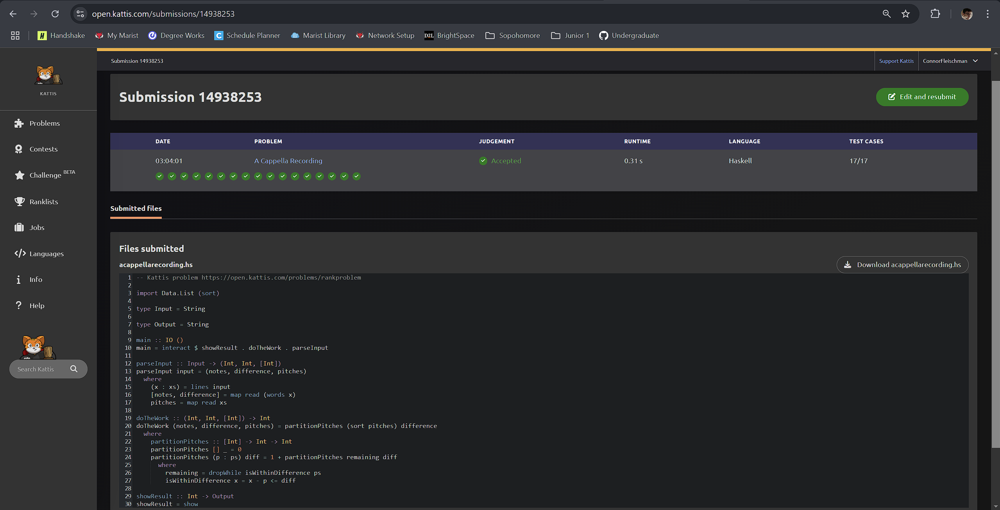

# Journal Entry for "A Cappella Recording"

---

## Problem Description

The problem involves finding the minimum times to sing a range of notes to complete as song, based on pitch values and a note difference. Given a set of pitches, determine the minimum number of times that a song must be performed, based on certain parameters, such as `notes` and `difference` in pitch allowed. The input consists of a first line with the number of notes and the allowed difference in notes, followed by several pitches. The aim is to process them, compute the required number of recordings to record all pitches given some difference, and report the desired results.

---

## Approach and Solution

### Step-by-Step Approach

1. **Input Parsing**: The first step was to correctly parse the input. The input format included the number of `notes`, the `difference` value, and a list of pitches. I used Haskell's `map` and `words` functions to read the values and split them into their appropriate components.

    ```haskell
    parseInput :: Input -> (Int, Int, [Int])
    parseInput input = (notes, difference, pitches)
      where
        (x : xs) = lines input
        [notes, difference] = map read (words x)
        pitches = map read xs
    ```

    The parsing logic had to be structured to handle breaking apart the different types of information, splitting the difference and number of notes, and the pitches. This resulted in a complexity of $O(p)$.

2. **Sorting the Pitches**: Once the input was parsed, I sorted the pitch values using Haskell's built-in `sort` function. This function uses a $O(p \log p)$ sorting algorithm to order the pitches. Sorting was essential because it simplified finding groupings that satisfy the `difference` requirement.

    ```haskell
    import Data.List (sort)
    ```

    ```haskell
    doTheWork :: (Int, Int, [Int]) -> Int
    doTheWork (notes, difference, pitches) = partitionPitches (sort pitches) difference
    ```

3. **Processing the Pitches**: After sorting, I focused on determining valid pitch groupings. I attempted a purely recursive approach, this is not the most efficient method as its complexity would be $O(p^2)$, where $p$ is the number of pitches, however it is simple to implement and consistent. This resulted in a more iterative approach where we take every possible pitch, check for an edge case, then if it passes it compensates for the first pitch and recurses on the remaining (valid difference) pitches using the diff.

    ```haskell
      where
        partitionPitches :: [Int] -> Int -> Int
        partitionPitches [] _ = 0
        partitionPitches (p : ps) diff = 1 + partitionPitches remaining diff
          where
            remaining = dropWhile isWithinDifference ps
            isWithinDifference x = x - p <= diff
    ```

### Overall Complexity

Overall, since processing the pitches resulted in a $O(p^2)$ complexity, which dominates the $O(p \log p)$ or $O(p)$ complexity, the real bulk of computing comes from processing the pitches making the runtime at worst $O(p^2)$.

### Challenges and Difficulties

- **Understanding the Grouping Requirement**: Initially, I found it challenging to determine how the `difference` value affected pitch groupings. But after rereading the problem and designing some code it revealed itself.

- **Input Parsing Complexity**: Properly parsing the input was also tricky due to the need to extract different types of information from the input string. I initially treated the input as a single list of integers, which led to parsing errors. I then revised parsing to properly split and handle the number of `pitches` and `difference`.

### Testing and Debugging

Testing played a crucial role in refining the solution. I created multiple test cases to validate my implementation was correct:

- **Edge Cases**: Scenarios where the number of pitches was fewer than the specified number of `notes` or where the `difference` was too large or too small.
  
- **Identical Pitches**: Cases where all pitches had the same value, which helped verify if the grouping logic worked.

For debugging, I relied on Hoogle, a Haskell search engine. I also utilized ChatGPT for help with building out the parse section as it was challenging splitting up the input into its respective parts.

### Resources Utilized

- **Haskell Documentation**: The official Haskell documentation was invaluable for understanding how to use functions like `sort` and `map`. These resources provided detailed explanations and examples that guided my implementation.

- **Community Forums / Hoogle**: I consulted online forums and community discussions for insights into functional programming best practices. I also utilized Hoogle's wide array of Haskell functions and modules. If I needed to use a built-in function i would Hoogle-it.

- **Course Notes**: My course notes on functional programming helped me understand how to structure the solution in an idiomatic Haskell manner. This was important for ensuring that the code was not only correct but also efficient and readable.

---

## Code Walkthrough

The final Haskell implementation is as follows:

```haskell
import Data.List (sort)

type Input = String
type Output = String

main :: IO ()
main = interact $ showResult . doTheWork . parseInput

parseInput :: Input -> (Int, Int, [Int])
parseInput input = (notes, difference, pitches)
  where
    (x : xs) = lines input
    [notes, difference] = map read (words x)
    pitches = map read xs

doTheWork :: (Int, Int, [Int]) -> Int
doTheWork (notes, difference, pitches) = partitionPitches (sort pitches)

showResult :: Int -> Output
showResult = show
```

- **`parseInput`**: Handles the input parsing, breaking the input into `notes`, `difference`, and `pitches` components.

- **`doTheWork`**: Processes the sorted pitches to determine the parings based on the given `difference` value.

- **`showResult`**: Returns the number of times the performer must record given the range, processed into string format to be output.

## Conclusion

The rank problem required careful parsing of input, sorting, and processing of pitches to determine the number of recordings needed to perform a song. Haskell breaks the task into manageable parts and with techniques like `map`, `sort`, and list manipulation, complex problems become more manageable.

This problem highlighted the importance of testing and debugging in functional programming. Testing with edge cases helped identify weaknesses in my program, and using community resources and Haskell documentation played a large role in resolving them and improving my solution.

---

## Screen Shot


