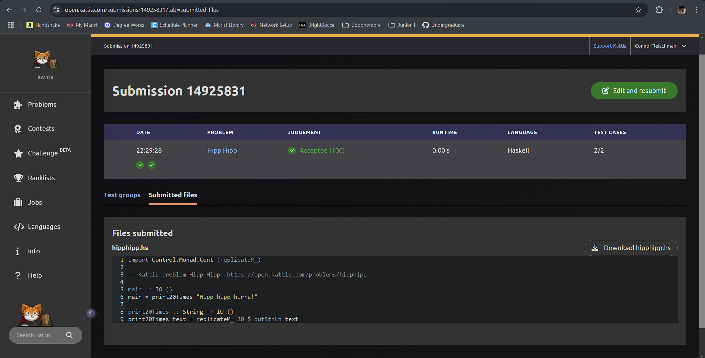

# Journal Entry for "Hipp Hipp"

---

## Problem Description

The problem requires us to print the phrase "Hipp hipp hurra!" exactly 20 times. This is a simple output problem where the correct solution is determined by strictly adhering to printing out the string 20 times only.

---

## Approach and Solution

### Understanding the Requirements

The task can be summarized as:

- Print the phrase "Hipp hipp hurra!" (case-sensitive) exactly 20 times.
- Each occurrence of the phrase must be on a new line.

---

### Implementation

Steps:

1. String Repetition:
   - The phrase "Hipp hipp hurra!" is repeated 20 times using Haskell’s `replicateM_`.

2. Output Handling:
   - Each repetition of the phrase is printed on a new line using `putStrLn`.

---

## Code

```haskell
import Control.Monad.Cont (replicateM_)

-- Kattis problem Hipp Hipp: https://open.kattis.com/problems/hipphipp

main :: IO ()
main = print20Times "Hipp hipp hurra!"

print20Times :: String -> IO ()
print20Times text = replicateM_ 20 $ putStrLn text
```

Key Details:

1. Import Statement:
   - The `replicateM_` function is imported from the `Control.Monad.Cont` library. This function executes the provided action a specified number of times.

2. Main Function:
   - The `main` function calls `print20Times`, passing the required phrase ("Hipp hipp hurra!") as an argument.

3. print20Times Function:
   - This function prints the given phrase (`text`) 20 times. It uses `replicateM_` to loop the `putStrLn` action.

---

## Challenges and Debugging

### Ensuring Correctness

The main challenge was remembering the monadic properties of `IO ()`

- Using `replicateM_` instead of `replicate` since `putStrLn` puts *String* types into the *IO* monad which requires the `M` monadic replicate.

### Testing

- Verified on Kattis through problem submission.

---

## Screenshot


