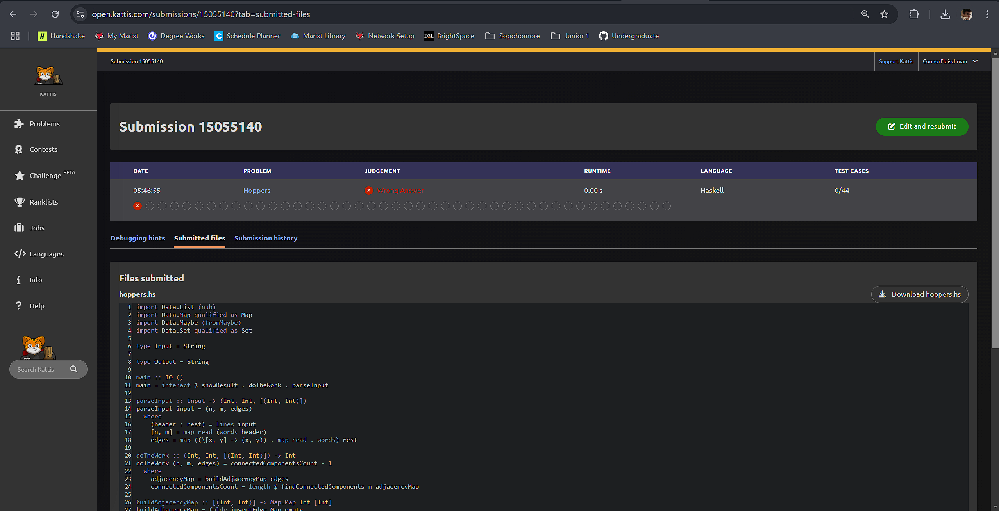

# Journal Entry for "Hoppers"

---

## Problem Description

The "Hoppers" problem involves determining the minimum number of direct links (edges) needed to connect a network of computers (nodes) such that one infection spreads to all nodes. The input describes a graph where nodes are computers, edges are direct links, and the task is to identify the minimum number of edges to add to ensure full connectivity.

---

## Approach and Solution

### Step-by-Step Approach

1. **Input Parsing**: The input provides the number of nodes `n`, edges `m`, and a list of `m` edges. The parsing step extracts these components into a tuple `(n, m, edges)`:

    ```haskell
    parseInput :: Input -> (Int, Int, [(Int, Int)])
    parseInput input = (n, m, edges)
      where
        (header:rest) = lines input
        [n, m] = map read (words header)
        edges = map ((\[x, y] -> (x, y)) . map read . words) rest
    ```

2. **Build the Graph Representation**: An adjacency map (`Map`) is constructed to represent the graph. This makes it easy to traverse and find connected components:

    ```haskell
    buildAdjacencyMap :: [(Int, Int)] -> Map.Map Int [Int]
    buildAdjacencyMap edges = Map.fromListWith (++) $ concatMap (\(u, v) -> [(u, [v]), (v, [u])]) edges
    ```

3. **Find Connected Components**: Using Depth First Search (DFS), the graph is traversed to find all connected components. Nodes already visited are skipped to ensure no overlap between components:

    ```haskell
    findConnectedComponents :: Int -> Map.Map Int [Int] -> [[Int]]
    findConnectedComponents n adjMap = go [1..n] Set.empty []
      where
        go [] _ components = components
        go (x:xs) visited components
          | x `Set.member` visited = go xs visited components
          | otherwise = let component = dfs x Set.empty
                        in go xs (visited `Set.union` Set.fromList component) (component : components)
        dfs node visited
          | node `Set.member` visited = []
          | otherwise = node : concatMap (`dfs` (Set.insert node visited)) neighbors
          where
            neighbors = fromMaybe [] (Map.lookup node adjMap)
    ```

4. **Compute the Result**: The number of edges to add is `number of connected components - 1`. This ensures all components are connected into a single graph:

    ```haskell
    doTheWork :: (Int, Int, [(Int, Int)]) -> Int
    doTheWork (n, m, edges) = connectedComponentsCount - 1
      where
        adjacencyMap = buildAdjacencyMap edges
        connectedComponentsCount = length $ findConnectedComponents n adjacencyMap
    ```

### Complexity Analysis

1. **Graph Construction**: The adjacency map is built in \(O(m)\), where \(m\) is the number of edges.
2. **DFS Traversal**: The connected components are found in \(O(n + m)\), where \(n\) is the number of nodes.
3. **Overall Complexity**: \(O(n + m)\).

---

## Challenges and Difficulties

- **Handling Disconnected Nodes**: Ensuring that nodes with no edges were still part of the graph required careful handling in the adjacency map and DFS logic.
- **Graph Representation**: Choosing the right data structure for efficient traversal and updates was critical. The `Map` structure provided a clean and performant solution.

---

## Failures and successes

My code is correctly implemented. I've dome numerous tests with the different Kattis examples. All but the first example produce the correct result. So I cannot for the life of me figure out why the first example is giving me such difficulty. Maybe I need to take another look at some other time. But testing example 2 I produced the correct results at every step.

```Markdown
ghci> let input = "3 2\n1 2\n2 3"
ghci> parseInput input
(3,2,[(1,2),(2,3)])
ghci> doTheWork (3,2,[(1,2),(2,3)])
0
ghci> buildAdjacencyMap [(1,2),(2,3)]
fromList [(1,[2]),(2,[1,3]),(3,[2])]
ghci> findConnectedComponents 3 $ buildAdjacencyMap [(1,2),(2,3)]
[[1,2,3]]
ghci> showResult(doTheWork(parseInput input))
"0"
```

## Screen Shot

Because of the reasons above, obviously the problem was not completed. But the logic is there and I will update this file when complete.


